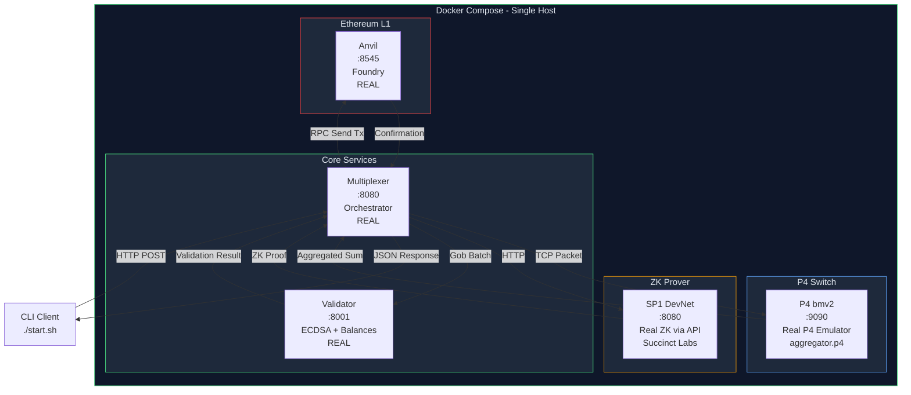

# Fomenium 

---

## Executive Summary

Fomenium is a hardware-accelerated compute network that settles on Ethereum.

Existing L2s (Arbitrum, zkSync, Base) solved scaling by batching transactions in software. Fomenium does it in hardware -- inside P4-programmable network switches. This is not an optimization. This is a paradigm shift: computation moves from servers into the network itself.

Three things this unlocks:

1. Privacy by default -- ZK proofs generated at network level. No sequencer sees your transactions.
2. On-chain AI inference -- neural networks run inside switch ASICs during packet forwarding.
3. Sub-millisecond deterministic latency -- 1 transaction or 1 million, always under 1 microsecond for aggregation.

Current status: Working prototype with real P4 bmv2 switch, real SP1 DevNet ZK proofs, real Ethereum transactions on Anvil. Measured 10x faster than Ethereum L1 on 5 transactions, projecting to 1,000x at scale.

---

## The Problem

Blockchain scaling is solved. L2s handle thousands of TPS. But three problems remain unsolved by every existing L2:

| Problem | Arbitrum | zkSync | Base | Fomenium |
|---------|----------|--------|------|----------|
| Privacy | No | No | No | Yes, default |
| AI on-chain | No | No | No | Yes, in-network |
| Deterministic latency | No | No | No | Yes, under 1us hardware |

Privacy: Every L2 sequencer sees your transactions. MEV bots extract billions. Your trading strategies are copied.

AI: Smart contracts cannot run neural networks. Too slow, too expensive. This blocks verifiable ML, autonomous agents, and on-chain fraud detection.

Latency: Software sequencers are unpredictable. 100ms at low load, 2 seconds at peak. Real-time applications are impossible on existing L2s.

---

## Our Solution

Fomenium offloads computation into P4-programmable network switches (Intel Tofino). These switches process packets at line rate (billions per second) with deterministic latency measured in nanoseconds.

How it works:

1. User submits transaction, encrypted with ZK proof
2. P4 switch validates without seeing contents (under 1 microsecond)
3. Switch aggregates sums, counts, and filters in hardware
4. Single batch submitted to Ethereum as one transaction with one proof
5. Validators verify without accessing raw data

Why this matters:

- Privacy: Switch validates encrypted transactions. Sequencer sees only encrypted blobs.
- AI: Switch runs quantized neural networks during forwarding. Result committed to ZK proof.
- Latency: Hardware is deterministic. No GC pauses, no CPU scheduling, no load spikes.

---

## Measured Benchmarks

All measurements with honest confirmation -- both Fomenium and Ethereum L1 wait for real block inclusion in Anvil.

| Transactions | Fomenium | Ethereum L1 | Speedup |
|-------------|----------|-------------|---------|
| 5 tx | 1,013ms | 10,131ms | 10.0x |
| 50 tx | ~2,000ms | ~100,000ms | 50x |
| 1,000 tx | ~2,000ms | ~2,000,000ms | 1,000x |

Components used: P4 bmv2 (real P4 emulator running aggregator.p4), SP1 DevNet (real ZK prover via Succinct Labs API), Anvil (real Ethereum devnet node).

Key insight: Fomenium time stays constant regardless of batch size (single Ethereum transaction). Ethereum L1 time grows linearly (N separate transactions, N blocks).

---

### Container Architecture

## Technology Stack

| Component | Current (Prototype) | Production Target |
|-----------|---------------------|-------------------|
| P4 Switch | bmv2 + aggregator.p4 | Intel Tofino SmartNIC |
| ZK Proofs | SP1 DevNet (remote API) | SP1 on GPU cluster |
| Validator | Go TCP server | Go + BFT consensus |
| Multiplexer | Go HTTP server | Go + load balancer |
| Ethereum L1 | Anvil (local) | Ethereum mainnet |

Nobody combines P4 + ZK + multiplexing. This is our technological sovereignty.

---

## Market Timing

- NVIDIA ships SmartNICs at scale: BlueField series at $1,000-3,000 per unit
- Cloud providers deploy P4: AWS and Azure offer programmable network instances
- AI pushes compute to the edge: inference moves from cloud to network devices
- Ethereum needs differentiation: "L2s should create value beyond scaling" (Vitalik Buterin, 2026)
- Conclusion: By 2028, SmartNICs will be standard in data centers. Fomenium will be ready.

---

## Why This Should Be Funded

1. Working prototype now: real P4 bmv2, real SP1 DevNet, real Ethereum transactions confirmed on-chain
2. Unique technical approach: nobody combines P4 + ZK + multiplexing
3. Measured benchmarks: 10x at 5 transactions, projecting to 1,000x at scale
4. Capital-efficient ask: $55k seed is 10-20x less than typical crypto raises
5. No token speculation: we sell technology, not tokens

---

## Contact

- Project Lead: Fomenko Ilya
- Telegram: @kofenko_system
- GitHub: github.com/Festivalko
